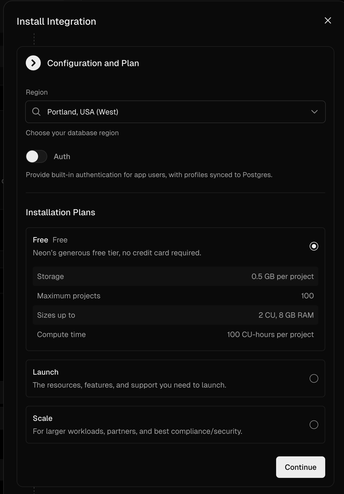
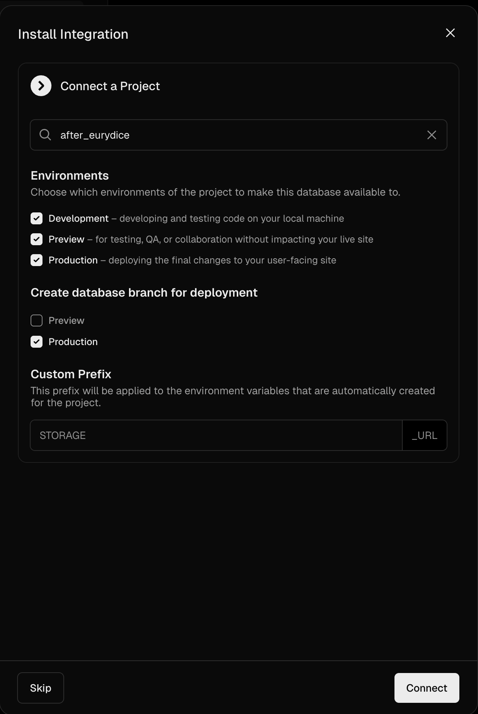

# Inklink

An open-source platform for crowdsourcing reader feedback on your writing. Clone the repo, deploy for free, and get a link you can send to beta readers.

Readers highlight passages and leave likes, dislikes, comments, and suggested edits. The author gets a dashboard with heatmaps, retention curves, and cross-version feedback tracking — all without readers seeing each other's responses.

## Deploy

Click the button to deploy your own instance. You'll need a [Neon](https://neon.tech) Postgres database (free tier works).

[](https://vercel.com/new/clone?repository-url=https%3A%2F%2Fgithub.com%2Fdivyavenn%2Finklink&env=TITLE,AUTHOR_DASH_PASSWORD&envDescription=Book%20title%20(required)%20and%20dashboard%20password%20(optional)&envLink=https%3A%2F%2Fgithub.com%2Fdivyavenn%2Finklink%23environment-variables&project-name=inklink&repository-name=inklink&products=[{%22type%22:%22integration%22,%22integrationSlug%22:%22neon%22,%22productSlug%22:%22neon%22,%22protocol%22:%22storage%22}])

Use these settings when configuring the Neon integration:




The Neon integration will provision a database and set `DATABASE_URL` automatically. The schema bootstraps itself on first deploy.

### Environment variables

| Variable | Required | Description |
|---|---|---|
| `DATABASE_URL` | Yes | Neon Postgres connection string (set automatically by the integration) |
| `TITLE` | Yes | Your book's title — the URL slug is derived from this automatically |
| `AUTHOR_DASH_PASSWORD` | No | Password-protect the author dashboard |
| `NEXT_PUBLIC_BASE_URL` | No | Your deploy URL, used for generating invite links |

## Local development

```bash
git clone https://github.com/divyavenn/inklink.git
cd inklink
npm install
cp .env.example .env.local   # fill in DATABASE_URL and book config
npm run dev
```

To seed the database with historical commits and sample data:

```bash
npm run seed
```

## Writing chapters

Add markdown files to `chapters/` with frontmatter:

```markdown
---
title: "Chapter 1: The Beginning"
order: 1
---

Your chapter content here.
```

Push to your deploy branch and Inklink ingests the new commit automatically.

## Staying up to date

Your deployed repo includes a GitHub Action that checks for upstream updates every Monday. When new changes are available, it opens a PR in your repo that you can review and merge from GitHub — no git commands needed.

To pull updates manually at any time, go to **Actions > Sync upstream > Run workflow** in your repo.

## Features

- **Inline feedback** — readers highlight text and react, comment, or suggest edits
- **Feedback heatmap** — see which passages get the most engagement
- **Version-aware** — feedback stays anchored to the version it was given on, with cross-version mapping so old signal survives into new drafts
- **Retention tracking** — see where readers stop, how long they spend, and completion rates
- **Email capture** — readers can leave their email if they want the finished book
- **Private by default** — readers can't see each other's feedback
- **Unique reader links** — invite readers individually or by group, track who gave what
- **Git-backed** — chapter history comes from your repo's commit log

## Tech stack

- Next.js 15 (App Router)
- TypeScript
- Styled Components
- Framer Motion
- Neon Postgres (serverless driver)
- simple-git for version history

## License

MIT
